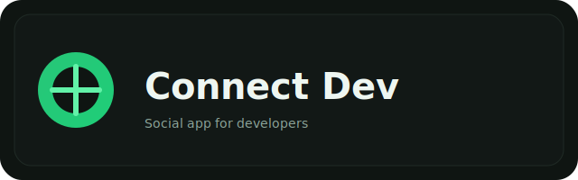

# Connect Dev



Rede social de estudos construída em Node.js/Express com views Mustache. Possui autenticação, feed, perfil com avatar/capa, seguir/seguir, upload de mídia no Supabase e suporte a MySQL ou Postgres.

## Principais funcionalidades
- Cadastro/Login com sessão (`express-session`) e hash de senha (`bcryptjs`).
- Perfil com edição de dados, avatar e capa enviados para Supabase Storage.
- Feed de posts, curtidas e comentários (render Mustache).
- Seguidores/seguindo e pesquisa de usuários.
- Flash messages para feedback rápido.

## Arquitetura
- **Camadas**: Controller → Service → Repository → DB. Controllers lidam com HTTP/views, Services concentram regras e integrações (ex.: Supabase), Repositories fazem I/O no banco.
- **Views server-side**: Mustache + partials.
- **Sessão/estado**: `express-session` com store MySQL ou Postgres (`connect-pg-simple`/`express-mysql-session`), cookies `sameSite=lax`.
- **Segurança**: Helmet habilitado com `crossOriginResourcePolicy: 'cross-origin'` para permitir imagens externas (Supabase). Validação com Zod.
- **Storage**: Supabase Storage (bucket `uploads`) para `avatars/` e `covers/`.

## Mapa de pastas (resumo)
- `src/app.ts`: bootstrap do servidor, middlewares, sessão, Helmet, views e rotas.
- `src/routes/`: arquivos de rota por domínio (`config`, `login`, etc.).
- `src/controller/`: controllers que recebem requests e montam respostas Mustache.
- `src/service/`: regras de negócio e integrações (ex.: `uploadService` → Supabase).
- `src/repository/`: acesso a dados (`userRepository` para CRUD de usuários).
- `src/database/`: config de conexão e migrations runner.
- `src/schema/`: validações Zod (auth).
- `src/utils/`: utilidades como `activePage` e `uploadConfig` (multer).
- `src/views/pages/`: páginas Mustache.
- `src/views/partials/`: componentes reutilizáveis (header, sidebar, feed, etc.).
- `public/`: estáticos (CSS, JS, imagens, placeholders locais).

## Requisitos de ambiente
Use `.env.example` como base. Campos principais:
```
PORT=3000
DB_DIALECT=mysql            # ou postgres
DB_HOST=127.0.0.1
DB_PORT=3306
DB_USER=root
DB_PASS=1234
DB_NAME=connect_dev
# Postgres em produção: DATABASE_URL e PGSSL=true

SUPABASE_URL=https://<project>.supabase.co
SUPABASE_ANON_KEY=<anon-jwt>
SUPABASE_SERVICE_KEY=<service-role-jwt>
```

## Como rodar
1) Instalar dependências  
`npm install`

2) Rodar migrations (automático na subida: `runMigrations` em `app.ts`).

3) Dev com reload  
`npm run dev`

4) Build  
`npm run build`

5) Produção  
`npm start`

## Observações sobre mídia
- Upload de avatar/capa vai para Supabase (`uploads/avatars` e `uploads/covers`), com URLs públicas salvas no banco.
- Helmet já permite carregar essas imagens externas; nada extra é necessário no frontend.
